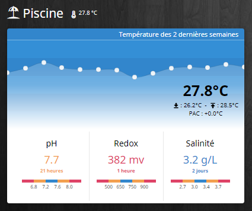

Widget BlueConnectPool
======================

Voici un aperçu du résultat final :

La mise en place de ce widget nécessite de récupérer dans un premier temps les informations du Blue Connect via IFTTT. Une fois les informations récupérer dans Jeedom, un premier script les analyseras et calculeras certaines informations. Puis un Virtuel sera créer afin d'obtenir ce resultat.

## Mise en place d'IFTTT

