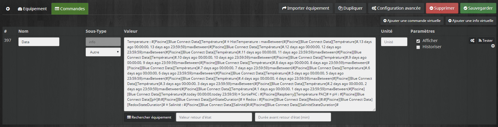

Widget BlueConnectPool
======================

Voici un aperçu du résultat final :


La mise en place de ce widget nécessite de récupérer dans un premier temps les informations du Blue Connect via IFTTT. Une fois les informations récupérer dans Jeedom, un premier script les analysera et calculeras certaines informations. Puis un virtuel sera créé afin d'obtenir ce résultat.

## Mise en place d'IFTTT

L’idée est de récupérer d'un seul coup les différentes valeurs du Blue Connect et les stocker sous forme d'une chaine de caractères dans une info d'un virtuel puis d'exécuter un scénario pour splitter les infos et en calculer d'autres.

Création du virtuel :


On va ensuite sur IFTTT pour créer un nouvel Applets qui va donc mettre à jour l’ID 383 dans mon cas : #[Piscine][Blue Connect Data][Data]# :


Voici l'URL à renseigner dans IFTTT (pensez à remplacer {IP}, {CLE} et {ID VIRTUEL} par vos valeurs) :
> https://{IP}/core/api/jeeApi.php?apikey={CLE}&type=virtual&id={ID VIRTUEL}&value=Temperature : {{Temperature}} -- pH : {{Ph}} -- Redox : {{Orp}} -- Conductivite : {{Conductivity}} -- Salinite : {{Salinity}}

## Traitement des données d'IFTTT et calculs

Il reste maintenant à créer un scenario dans Jeedom qui sera déclenché lors de la mise à jour de #[Piscine][Blue Connect Data][Data]# par IFTTT :


Chez moi, le Blue Connect est dans le local piscine. La filtration fonctionnant de 7h à 21h, je ne souhaite pas prendre en compte les mesures qui remontent lorsque celle-ci est éteinte car elles sont erronées.


Le premier code va récupérer la chaîne de caractères stocké dans #[Piscine][Blue Connect Data][Data]# et la découper pour mettre à jour :
* #[Piscine][Blue Connect Data][Température]#"
* #[Piscine][Blue Connect Data][pH]#
* #[Piscine][Blue Connect Data][Redox]#
* #[Piscine][Blue Connect Data][Salinité]#
* #[Piscine][Blue Connect Data][Conductivité]#

```php
$data = cmd::byString("#[Piscine][Blue Connect Data][Data]#")->execCmd();
foreach (explode("--", $data) as $entry) {
	list($name, $value) = explode(":", trim($entry));
	switch (trim($name)) {
		case "Temperature":
			cmd::byString("#[Piscine][Blue Connect Data][Température]#")->event(trim($value));
			break;
		case "pH":
			cmd::byString("#[Piscine][Blue Connect Data][pH]#")->event(trim($value));
			break;
		case "Redox":
			cmd::byString("#[Piscine][Blue Connect Data][Redox]#")->event(trim($value));
			break;
		case "Salinite":
			cmd::byString("#[Piscine][Blue Connect Data][Salinité]#")->event(trim($value));
			break;
		case "Conductivite":
			cmd::byString("#[Piscine][Blue Connect Data][Conductivité]#")->event(trim($value));
			break;
	}
}
```

Le deuxième bloque de code va permettre de calculer depuis combien de temps le pH, le Redox, la salinité et la conductivité sont dans les bornes bleu, orange ou rouge. Il est possible d'ajuster les bornes en fonction de vos équipement en changeant les valeurs des variables rangePh, rangeRedox, rangeSalinite ou rangeConductivite. Les valeurs suivantes vont être mise à jour :
* #[Piscine][Blue Connect Data][pHStateDuration]#
* #[Piscine][Blue Connect Data][RedoxStateDuration]#
* #[Piscine][Blue Connect Data][SalinitéStateDuration]#
* #[Piscine][Blue Connect Data][ConductivitéStateDuration]#

```php
function stateDurationInRange($cmdId, $range) {
	$actualValue = cmd::byString($cmdId)->execCmd();
	foreach ($range as $name => $terminals) {
		if ($terminals[0] <= $actualValue && $actualValue <= $terminals[1]) {
			$minRange = $terminals[0];
			$maxRange = $terminals[1];
		}
	}

	$cmdId = cmd::byString($cmdId)->getId();
	$histories = array_reverse(history::all($cmdId));
	if (count($histories) == 0) { return 0; }

	$dateTo = date('Y-m-d H:i:s');
	for ($cpt = 0; $cpt < count($histories); $cpt++) {
		if ($histories[$cpt]->getValue() < $minRange || $histories[$cpt]->getValue() > $maxRange) {
			return strtotime($dateTo) - strtotime($dateFrom);
		}
		$dateFrom = $histories[$cpt]->getDatetime();
	}

	return 0;
}

function secondsToHumanlyReadableText($seconds) {
	if ($seconds < 60) {
		return $seconds . " s";
	} else if ($seconds <= 3600) {
		return intval(($seconds % 3600) / 60) . " min";
	} else if ($seconds <= 86400) {
		return intval(($seconds % 86400) / 3600) . " heure" . (intval(($seconds % 86400) / 3600) > 1 ? "s" : "");
	} else if ($seconds <= 604800) {
		return intval(($seconds % 604800) / 86400) . " jour" . (intval(($seconds % 604800) / 86400) > 1 ? "s" : "");
	} else {
		return intval(($seconds % 2622662) / 604800) . " semaine" . (intval(($seconds % 2622662) / 604800) > 1 ? "s" : "");
	}
}

// Durée de l'état du pH
$rangePh = array("Danger1"  => array(0, 6.7),
                 "Warning1" => array(6.8, 7.1),
                 "OK"       => array(7.2, 7.6),
                 "Warning2" => array(7.7, 8),
                 "Danger2"  => array(8.1, 14));
$duration = stateDurationInRange("#[Piscine][Blue Connect Data][pH]#", $rangePh);
cmd::byString("#[Piscine][Blue Connect Data][pHStateDuration]#")->event(secondsToHumanlyReadableText($duration));

// Durée de l'état du Redox
$rangeRedox = array("Danger1"  => array(0, 499),
                    "Warning1" => array(500, 649),
                    "OK"       => array(650, 750),
                    "Warning2" => array(751, 900),
                    "Danger2"  => array(901, 100000));
$duration = stateDurationInRange("#[Piscine][Blue Connect Data][Redox]#", $rangeRedox);
cmd::byString("#[Piscine][Blue Connect Data][RedoxStateDuration]#")->event(secondsToHumanlyReadableText($duration));

// Durée de l'état de la salinité
$rangeSalinite = array("Danger1"  => array(0, 2.6),
                       "Warning1" => array(2.7, 2.9),
                       "OK"       => array(3.0, 3.4),
                       "Warning2" => array(3.5, 3.7),
                       "Danger2"  => array(3.8, 100));
$duration = stateDurationInRange("#[Piscine][Blue Connect Data][Salinité]#", $rangeSalinite);
cmd::byString("#[Piscine][Blue Connect Data][SalinitéStateDuration]#")->event(secondsToHumanlyReadableText($duration));

// Durée de l'état de la conductivité
$rangeConductivite = array("Danger1"  => array(0, 199),
                           "Warning1" => array(200, 299),
                           "OK"       => array(300, 10000),
                           "Warning2" => array(10001, 12000),
                           "Danger2"  => array(12001, 99999999));
$duration = stateDurationInRange("#[Piscine][Blue Connect Data][Conductivité]#", $rangeConductivite);
cmd::byString("#[Piscine][Blue Connect Data][ConductivitéStateDuration]#")->event(secondsToHumanlyReadableText($duration));
```

## Mise en place du virtuel et du widget

Les données étant stockées dans notre virtuel "Blue Connect Data", il faut créer un nouveau virtuel sur lequel on appliquera notre Widget. Ce virtuel contient une seule entrée qui sera la concaténation de toutes les infos nécessaires pour notre widget :



Pour simplifier la saisie voici le texte à insérer dans le virtuel à adapter en fonction de votre configuration :
* [Piscine][Blue Connect Data] est le virtuel précédemment créer qui contient toutes les informations
* [Piscine][Raspberry][Température PAC] correspond à la sonde de température en sortie de la PAC qui me permet de calculer le gain de la PAC

> Temperature : #[Piscine][Blue Connect Data][Température]# ¤ HistTemperature : maxBetween(#[Piscine][Blue Connect Data][Température]#,13 days ago 00:00:00, 13 days ago 23:59:59);maxBetween(#[Piscine][Blue Connect Data][Température]#,12 days ago 00:00:00, 12 days ago 23:59:59);maxBetween(#[Piscine][Blue Connect Data][Température]#,11 days ago 00:00:00, 11 days ago 23:59:59);maxBetween(#[Piscine][Blue Connect Data][Température]#,10 days ago 00:00:00, 10 days ago 23:59:59);maxBetween(#[Piscine][Blue Connect Data][Température]#,9 days ago 00:00:00, 9 days ago 23:59:59);maxBetween(#[Piscine][Blue Connect Data][Température]#,8 days ago 00:00:00, 8 days ago 23:59:59);maxBetween(#[Piscine][Blue Connect Data][Température]#,7 days ago 00:00:00, 7 days ago 23:59:59);maxBetween(#[Piscine][Blue Connect Data][Température]#,6 days ago 00:00:00, 6 days ago 23:59:59);maxBetween(#[Piscine][Blue Connect Data][Température]#,5 days ago 00:00:00, 5 days ago 23:59:59);maxBetween(#[Piscine][Blue Connect Data][Température]#,4 days ago 00:00:00, 4 days ago 23:59:59);maxBetween(#[Piscine][Blue Connect Data][Température]#,3 days ago 00:00:00, 3 days ago 23:59:59);maxBetween(#[Piscine][Blue Connect Data][Température]#,2 days ago 00:00:00, 2 days ago 23:59:59);maxBetween(#[Piscine][Blue Connect Data][Température]#,1 days ago 00:00:00, 1 days ago 23:59:59);maxBetween(#[Piscine][Blue Connect Data][Température]#,today 00:00:00,today 23:59:59) ¤ SortiePAC : #[Piscine][Raspberry][Température PAC]# ¤ pH : #[Piscine][Blue Connect Data][pH]#;#[Piscine][Blue Connect Data][pHStateDuration]# ¤ Redox : #[Piscine][Blue Connect Data][Redox]#;#[Piscine][Blue Connect Data][RedoxStateDuration]# ¤ Salinité : #[Piscine][Blue Connect Data][Salinité]#;#[Piscine][Blue Connect Data][SalinitéStateDuration]#

Une ne reste plus qu'a créer votre widget "BlueConnectPool" :
* Version : Dashbord
* Type : Info
* Sous-type : Autre
* Ajouter les fichiers :
	* [Chart.min.js](Chart.min.js) : Bibliothèque permettant l'affichage de la courbe de température
	* [Pool.css](Pool.css) : Le fichier CSS de notre Widget
* Copier le code PHP [du widget](Widget.php). 

Attention de mettre à jour les liens "plugins/widget/core/template/dashboard/cmd.info.string.BlueConnectPool" si vous ne nommé pas le widget de la même manière.


Il ne reste plus qu'a profiter de la piscine !
